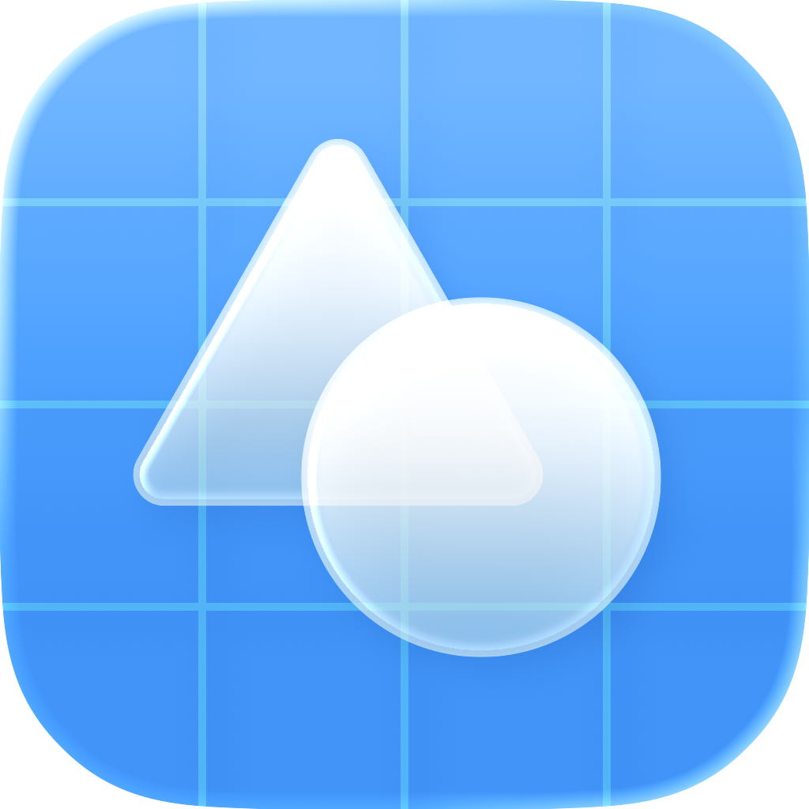

  
  <h1><b>viewable</b></h1>
  
The missing piece of Apple's documentation for SwiftUI.

  
  
  
  

---

## Credits

This project would have not been possible without the collective effort of the Swift community. Special thanks goes to [Hacking with Swift](https://www.hackingwithswift.com), [Sarunw](https://sarunw.com), and [SwiftLee](https://www.avanderlee.com) for their invaluable learning resources.

Additionally, this project also showcases the work of the following creators:

- [Spotted in Prod](https://www.spottedinprod.com)
- [AnyDistance](https://github.com/Any-Distance/any-distance-ios)
- [Artem Novichkov](https://artemnovichkov.com)

## License

This project is released under the MIT License. See [LICENSE](LICENSE.md) for details.

## Support

If you like this project, please consider giving it a ⭐️
